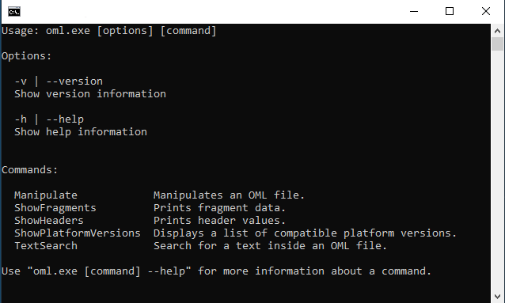

# OML Utilities

A small console application containing utility functions for OutSystems OML files.



## Platform Version

Any operation that involves reading or manipulating an OML file must specify the target platform version. Take it as the version of the Service Studio that should be used for opening the module. This is needed in order to load the correct DLL assemblies for decoding the contents of the OML file.

In the command line, the platform version starts with the letter "O" followed the relevant version number (e.g. "O9.1", "O11").

## Usage Examples

The examples below have <PlatformVersion> tags which must be replaced with the appropriate platform version.

#### Export OML as XML

```
oml Manipulate "<InputFilePath>" "<OutputFilePath>" <PlatformVersion> --format xml
```

This generates a XML file in the `OutputFilePath` destination containing all fragments. The `--format` option is optional if the destination file path ends with the ".xml" extension, e.g.:

```
oml Manipulate "C:\MyModule.oml" "C:\MyModule.xml" O11
```

#### List supported platform versions

```
oml ShowPlatformVersions
```

Lists the supported platform versions of the utility in ascending order. More versions can be added in the future.

By default, displayed platform versions are shown as labels (e.g. "O10"). If desired, versions can be retrieved fully-formatted (e.g. "9.1.603.0" instead of "O9.1") by adding the `--fullversion` flag:

```
oml ShowPlatformVersions --fullversion
```

Optionally, the `--latest` flag can be added as well for outputting only the highest supported platform version, e.g.:

```
oml ShowPlatformVersions --fullversion --latest
```

#### Show header values

```
oml ShowHeaders "<InputFilePath>" "<OutputFilePath>" <PlatformVersion>
```

Shows a list of headers and their respective values separated by comma (:). If desired, only a single header value can be shown by specifying the header name as the last parameter, e.g.:

```
oml ShowHeaders "C:\MyModule.oml" O11 Name
```

#### Change header values

```
oml Manipulate "<InputFilePath>" "<OutputFilePath>" <PlatformVersion> -H "<HeaderName>:<HeaderValue>"
```

Changes the value of one or more headers.

Multiple headers can be modified at once by repeating the `-H` option, e.g.:

```
oml Manipulate "C:\MyModule.oml" "C:\MyModule_Edited.oml" O11 -H "Name:MyModule" -H "Description:This is my module."
```

#### Replace XML fragment

```
oml Manipulate "<InputFilePath>" "<OutputFilePath>" <PlatformVersion> -F "<FragmentName>:<FragmentXmlContent>"
```

Replaces the XML contents of a fragment of the OML file. This enables advanced use cases by allowing to programatically modify the code an OML file and automating tasks that would be otherwise monotonous and time consuming in Service Studio.

Notice that the fragment is fully replaced by the new XML.

Multiple fragments can be modified at once by repeating the `-F` option, e.g.:

```
oml Manipulate "C:\MyModule.oml" "C:\MyModule_Edited.oml" O11 -F "FragmentName1:<MyXmlContent1 />" -F "FragmentName2:<MyXmlContent2 />"
```
